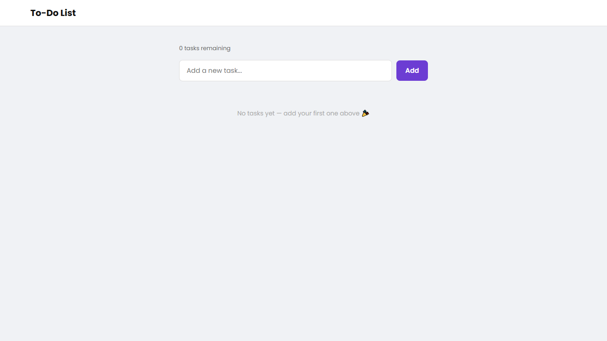
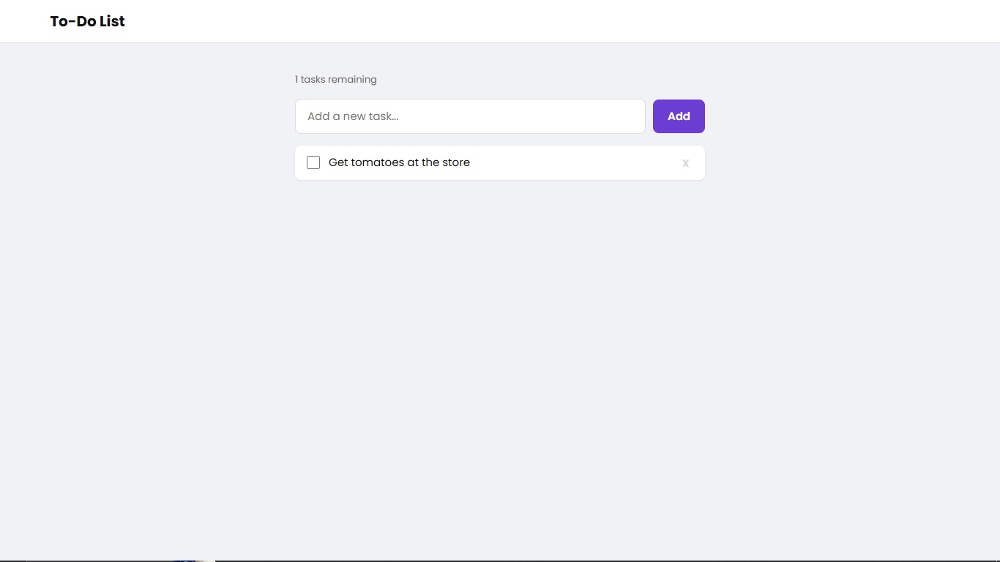
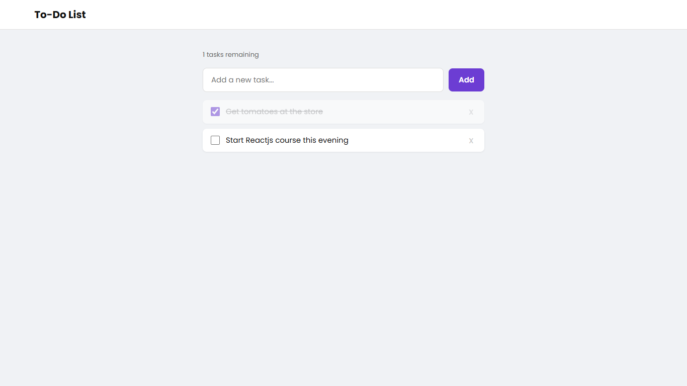
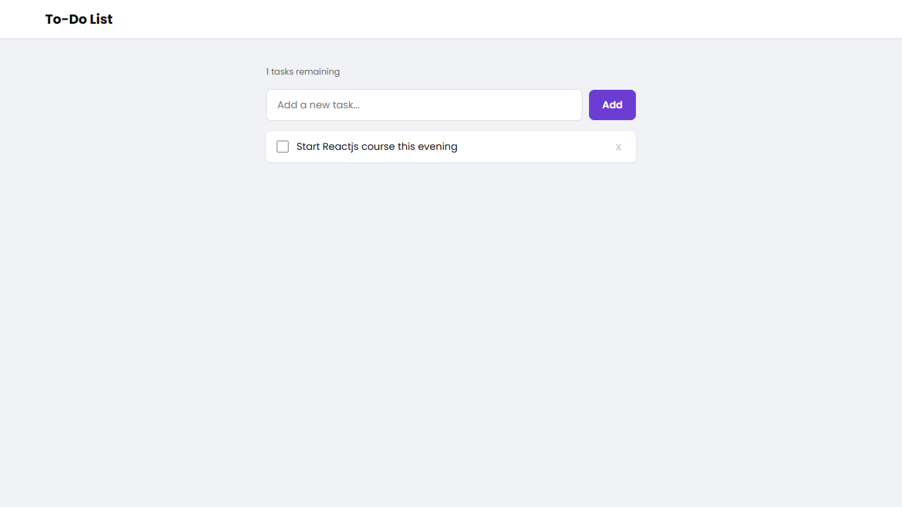

# To-Do List

A clean, array-driven to-do list that lets you add, complete,
and delete tasks — with live task count and an empty state.

## Live Demo

[Link here once deployed]

## Screenshots

**Empty State:**

**Tasks Added:**

**Task Completed:**

**Task Deleted:**

## Features

- Add tasks with Enter or the Add button
- Mark tasks complete with a checkbox (strikethrough + fade)
- Delete individual tasks
- Live count of remaining incomplete tasks
- Empty state message when no tasks exist
- Rejects empty or whitespace-only input

## Tech Stack

HTML, CSS, JavaScript (no frameworks)

## What I Learned

- Array as single source of truth — DOM always re-renders from data
- Event delegation on a parent element instead of individual buttons
- data-index attributes to link DOM elements back to array items
- Clear and re-render pattern to keep UI in sync with data
- Derived values (task count) calculated from array, never stored separately

## Known Limitations

- Tasks do not persist on page refresh (no localStorage yet)
- No drag-and-drop reordering
- No edit task functionality

## What I'd Improve With More Time

- Add localStorage persistence
- Add filter tabs (All / Active / Completed)
- Add drag-and-drop reordering
